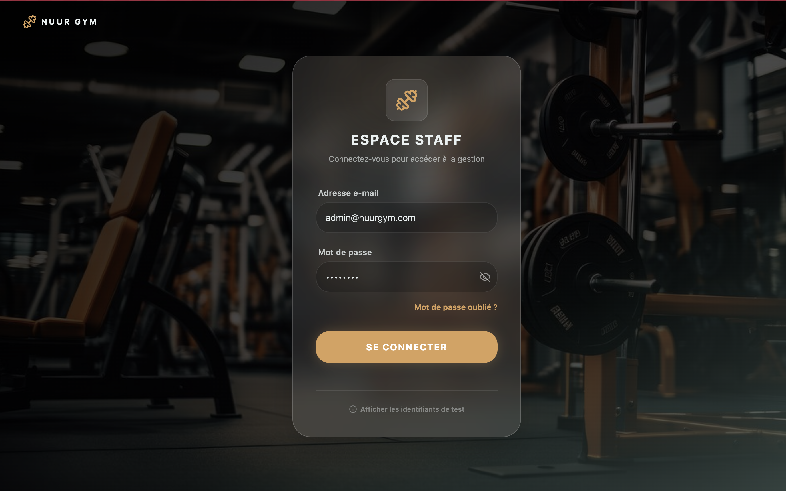
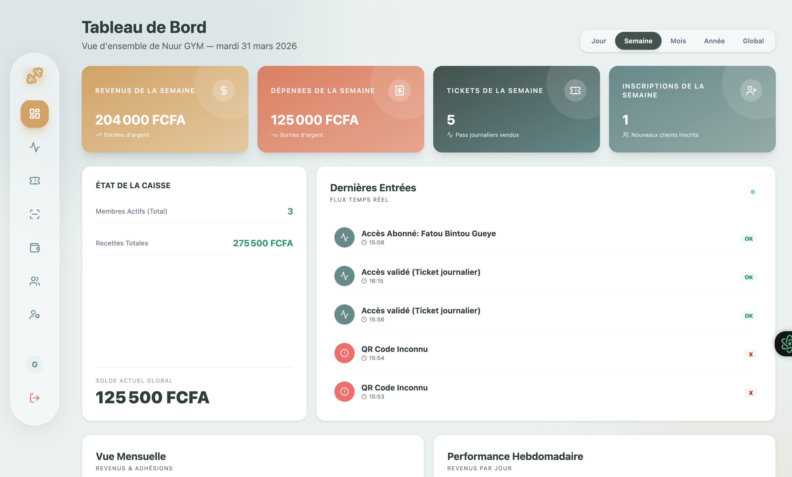

# Nuur GYM - Version Vue.js

Implémentation du frontend pour le système de gestion de salle de sport **Nuur GYM**. Développé avec **Vue.js 3** (Composition API), **Vite** et **TailwindCSS** pour une expérience utilisateur fluide et moderne.

---

## ✨ Fonctionnalités Clés

- **Tableau de Bord** : Vue d'ensemble des statistiques en temps réel.
- **Gestion des Activités** : Création et édition des tarifs et types d'activités.
- **Gestion des Clients** : Registre complet des membres et abonnements.
- **Billetterie & Accès** : Génération de tickets et scan de QR codes pour le contrôle d'accès.
- **Trésorerie** : Suivi des transactions (revenus et dépenses).
- **Gestion du Personnel** : Contrôle d'accès basé sur les rôles (Admin, Caissier, Contrôleur) avec recherche et filtrage.

---

## 📸 Aperçu

| 🔐 Connexion | 📊 Tableau de Bord |
| :---: | :---: |
|  |  |

---

## Lancement Rapide

### Prérequis

- **Node.js** (version 16 ou supérieure)
- **Backend** lancé (port 4000 par défaut)

### Installation

1. **Cloner le projet**
2. **Installer les dépendances** :

```bash
npm install
```

1. **Lancer le serveur de développement** :

```bash
npm run dev
```

---

## Stack Technique

- **Frontend** : Vue 3, Vite, TypeScript.
- **Styling** : TailwindCSS, Lucide Vue (Icônes).
- **State Management** : Pinia.
- **Routing** : Vue Router.
- **API** : Axios (connecté à [back-node](../back-node/)).

---

## Intégration Backend

Ce frontend communique avec l'API située dans le dossier `../back-node/`. Assurez-vous que le backend est opérationnel pour que les données s'affichent correctement.

---

## Notes pour les Tests

Sur la page de connexion, vous pouvez utiliser les **comptes de démonstration** (cliquez sur "Afficher les identifiants de test" en bas de la carte) pour explorer les différents profils (Administrateur, Caissier, Contrôleur).
